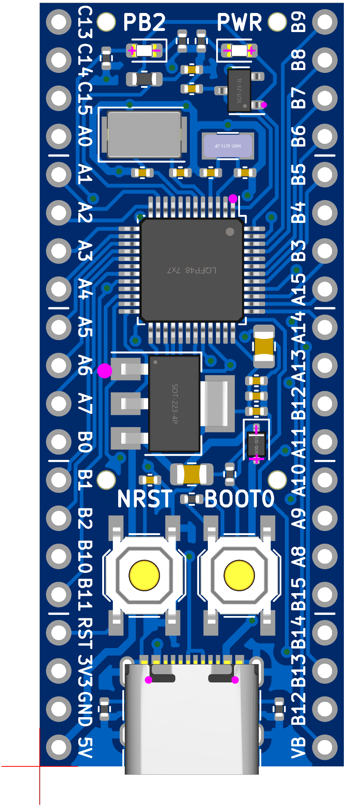

# STM32F1 Development Board

## Summary
Schematic and Board layout of STM32F1 Development Board. This project was created using [KiCAD](https://www.kicad.org/).

## MCU
STM32F103C8T6  
72Mhz, 20KB RAM, 64KB ROM  
[Datasheet](https://www.st.com/resource/en/datasheet/stm32f103cb.pdf)

## Board order at JLCPCB
I recommend ordering this board from JLCPCB. This board uses only Basic Parts excluding USB connector. Therefore, if you order this board, the price will be relatively low. 

When order this board, pay attention to the following.
1. If it is a small volume production (qty <= 30 or 50) and the parts on the bottom side are not assembled, order this board with Economic PCBA.
2. Order number is specified under the USB Connector. So you should select "Specify a location" for "Remove Order Number" option. 
3. Tooling holes (Radius 1.152mm hole) is already installed. So you should select "Added by Customer" for "Tooling holes" option.
4. For orders over 30 or 50 pieces, import tax should be imposed customs duties. (The tax border changes depending on the type of import and exchange rate.)

Order cost is depends on part cost and so on. For reference, the following is a rough estimate of the price when ordering the quantity (include shipping cost) (When using the $9 SMT coupon distributed by JLCPCB every month).
*  2 qty -> $12 ($6/brd)
*  5 qty -> $19 ($3.8/brd)
* 30 qty -> $82 ($2.8/brd) <- Customs duties may be imposed

## Features
* STM32F103C8T6 ARM Cortex M3
* `72 MHz` maximum frequency, `64 KB` of Flash memory, `20 KB` of SRAM
* `8 MHz` crystal (High-Speed Enternal Clock)
* `32.768 KHz` crystal (Low-Speed External Clock)
* Green LED `PB2` Active high
* Red power LED `PWR`
* 2x20 side pins
* Size: `50.80 mm x 20.32 mm`

* SPI Flash (Optional)
  * PA4 CS
  * PA6 MISO
  * PA7 MOSI
  * PA5 SCK

* USB Type-C
  * PA11 USB_DN
  * PA12 USB_DP

### Supported FLASH
* [W25QJVSSIQ](https://www.digikey.jp/ja/products/detail/winbond-electronics/W25Q32JVSSIQ/5803981)
* [IS25LP040E](https://akizukidenshi.com/catalog/g/gI-18046/)

Most SPI FLASH should be available. Check FLASH pinout before assemble.

## Parts List
You can see parts list from the BOM below.  
[Parts List](/production/bom.csv)

## Board Image

## LICENSE
[MIT LICENSE](/LICENSE)  
You may use it freely for personal use, but if you wish to use it for commercial purposes, I would appreciate it if you could contact us.
